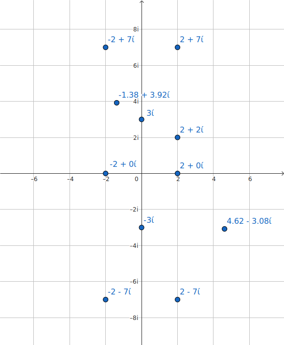

# 8. Kompleksie skaitļi

1. Atrisiniet vienādojumu 4z2+(4+4i)z+5+2i=0. Šoreiz minēt nav atļauts. Parādiet visus aprēķina soļus. Rezultātu pārbaudiet ar WA.

    $$
        4z^2+(4+4i)z+(5+2i)=0
    $$

    $$
        z=\frac{-(4+4i)\pm\sqrt{(4+4i)^2-4\cdot4\cdot(5+2i)}}{2\cdot4}
    $$

    $$
        z=\frac{-4-4i\pm\sqrt{32i - 80 - 32i}}{8}
    $$

    $$
        z=\frac{-4-4i\pm\sqrt{-80}}{8}
    $$

    $$
        z=\frac{-4-4i\pm\sqrt{80i}}{8}
    $$

    $$
        z=\frac{1}{2}+\frac{-1\pm\sqrt{5}}{2}\cdot i
    $$

    $$
        \begin{cases}
        z_1=\frac{1}{2}+\frac{-1+\sqrt{5}}{2}\cdot i
        \\
        z_2=\frac{1}{2}+\frac{-1-\sqrt{5}}{2}\cdot i
        \end{cases}
    $$

2. Attēlojiet kompleksajā plaknē šādus skaitļus: 2, -2, 3i, -3i, 2+2i, 2-2i, 2+7i, 2-7i, -2+7i, -2-7i, 20/(3+2i), (9+12i)/(2-3i).

    

3. Izmantojot slaidos doto paraugu, pierādiet komplekso skaitļu reizināšanas asociativitāti (distributīvais likumu šobrīd vēl nav pierādīts!).

    $$
        (z_1 \cdot z_2) \cdot z_3 = z_1 \cdot (z_2 \cdot z_3)
    $$

    $$
        ((x_1, y_1) \cdot (x_2, y_2)) \cdot (x_3, y_3) = (x_1, y_1) \cdot ((x_2, y_2) \cdot (x_3, y_3))
    $$

    ---

    $$
        (x_1 x_2 - y_1 y_2, x_1 y_2 + y_1 x_2) \cdot (x_3, y_3)
    $$

    $$
        ((x_1 x_2 - y_1 y_2) x_3 - (x_1 y_2 + y_1 x_2) y_3, (x_1 x_2 - y_1 y_2) y_3 + (x_1 y_2 + y_1 x_2) x_3)
    $$

    $$
        (x_1 x_2 x_3 - y_1 y_2 x_3 - x_1 y_2 y_3 - y_1 x_2 y_3 , x_1 x_2 y_3 - y_1 y_2 y_3 + x_1 y_2  x_3 + y_1 x_2 x_3)
    $$

    ---

    $$
        (x_1, y_1) \cdot (x_2 x_3 - y_2 y_3, x_2 y_3 + y_2 x_3)
    $$

    $$
        x_1 (x_2 x_3 - y_2 y_3) - y_1 (x_2 y_3 + y_2 x_3), x_1 (x_2 y_3 + y_2 x_3) + y_1 (x_2 x_3 - y_2 y_3))
    $$

    $$
        (x_1 x_2 x_3 - x_1 y_2 y_3 - y_1 x_2 y_3 - y_1 y_2 x_3, x_1 x_2 y_3 + x_1 y_2 x_3 + y_1 x_2 x_3 - y_1 y_2 y_3)
    $$
