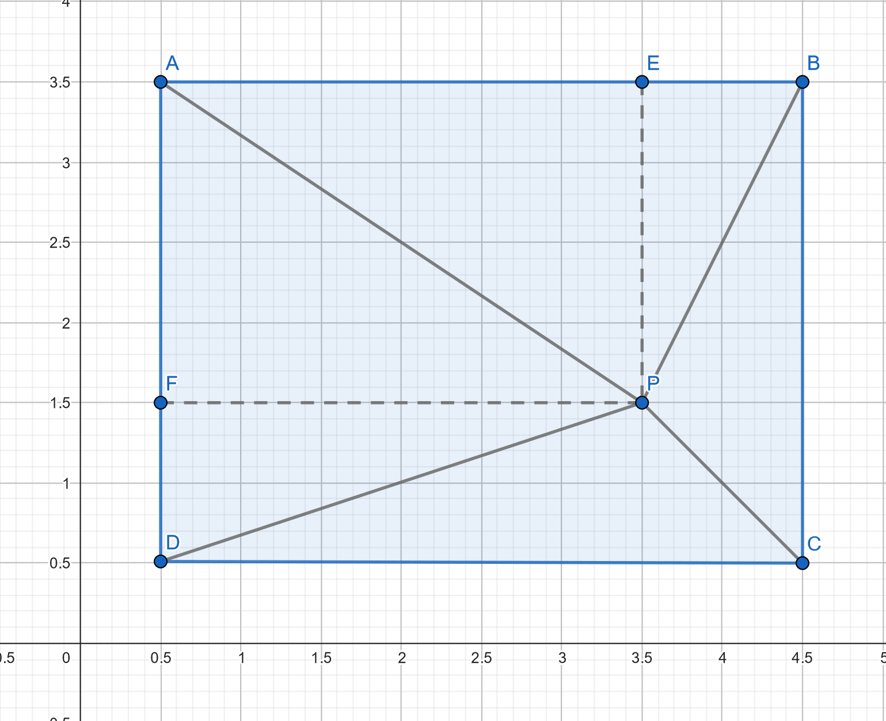

# Analītisa Ģeometrija I-iespēja 4

Gunārs Ābeltiņš

## Uzdevums

Pierādīt, ka jebkuram taisnstūrim ABCD un jeburam punktam P tā iekšienē

$$
PA^2 + PC^2 = PB^2 + PD^2
$$

## Risinājums

Pieņemam apzīmējumus:

$$
H = AD = BC \\
W = AB = CD \\
x = AE \\
y = AF
$$

Izmontojot pitagora teorēmu vienādību var parveidojam šādi:

$$
PA^2 + PC^2 = PB^2 + PD^2 \\
(x^2 + y^2) + ((H - x)^2 + (W - y)^2) = ((H - x)^2 + y^2) + (x^2 + (W - y)^2) \\
$$

Atveram iekavas un vienkāršojam:

$$
x^2 + y^2 + (H - x)^2 + (W - y)^2 = x^2 + y^2 + (H - x)^2 + (W - y)^2 \\
0 = 0
$$

Tātad vienādība ir patiesa.
